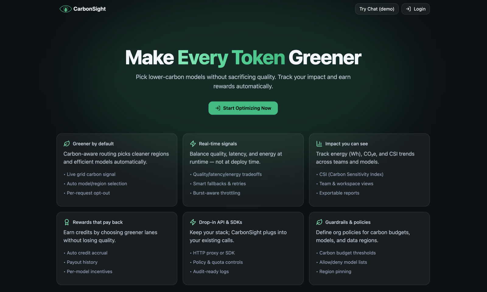
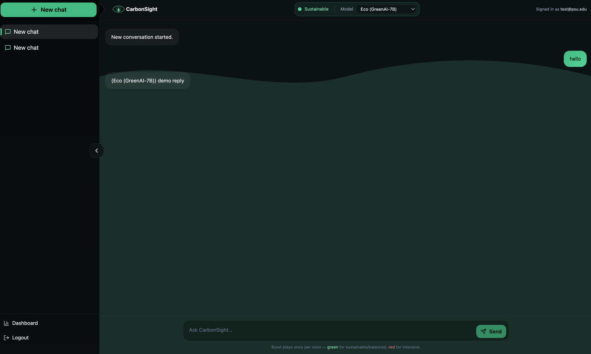

<h1 align="center">CarbonSight</h1>
<p align="center"><strong>Your AI efficiency, rewarded.</strong><br>
Carbon-aware routing for enterprise LLM use — pick lower-carbon models without sacrificing quality, and get paid for it.</p>

<p align="center">🏆 <strong>MLH — Best Use of the Gemini API</strong> · PennApps XXVI, 2025</p>



## The problem

Every AI prompt burns energy, and enterprises have no visibility into it. Cost shows up on an
invoice and latency shows up in a graph, but carbon shows up nowhere — so the default is to reach
for the largest model available. Summarising a paragraph on Gemini Pro burns energy that Flash
would have spent a fraction of, for an answer nobody could tell apart.

CarbonSight makes that trade visible at the moment of the call, and rewards the greener choice.

## How it works

### Agentic routing (Google ADK)

Four agents decide how each prompt gets answered:

| Agent | Job |
|---|---|
| **Root** | Orchestrates requests between sub-agents |
| **Routing** | Picks the Gemini model — Flash, Pro, or Flash-Lite — against CO₂ and latency thresholds |
| **Embedding** | Generates embeddings to detect semantically similar prompts and serve them from cache |
| **Thinking** | Allocates a thinking budget per prompt: ~0 for easy, ~2048 for medium, ~8192 for hard |

**Auto-switch on** routes dynamically and reports back inline:

```
Used: Gemini Flash | 0.05 kWh | 20g CO₂ | 0.002 $GREEN earned
```

**Auto-switch off** hands the choice to the employee, colour-coded by cost — high energy (Pro) in
red, efficient (Flash) in blue.

### Semantic caching

Gemini `embedding-001` compares each prompt against previous ones. Near-duplicates are served from
cache instead of recomputed — the cheapest token is the one you never spend.

### Quality vs. energy, as a dial

An error-tolerance slider (3% baseline) drives the thinking budget. Lower tolerance buys accuracy
with energy; higher tolerance trades a little accuracy for a lot less of it.

### Proof-of-Green rewards

Every green swap — Flash where Pro was the default — is logged to the chain. Smart contracts on
Polygon testnet mint **ERC-20 `$GREEN`** at `CO₂_saved_grams / 10`, plus **ERC-721** badges in
bronze, silver, and gold. Enterprises get a verifiable ledger; employees get a wallet-linked reason
to care.

## Dashboards



**Team** — prompting panel with inline feedback, leaderboards by model mix and carbon saved, and
team stats: average latency, CO₂ saved against baseline, cost savings, tokens and badges earned,
with trendlines and weekly reports. Advanced analytics run hypothesis tests, regression forecasts,
and ANOVA comparisons with boxplots and confidence bands.

**Admin** — org-wide leaderboards, a model-usage heatmap surfacing the carbon hogs, the ledger of
`$GREEN` payouts, and exportable CO₂ certificates for ESG reporting.

Picking a lane plays a colour burst — green for sustainable and balanced, red for intensive. Small
thing, but it is the whole thesis in one interaction: make the carbon cost of a choice something
you *feel* while making it.

## Stack

**Backend** — Python · Google ADK · Gemini API · FastAPI
**Frontend** — React 19 · TypeScript · Vite · Recharts · Framer Motion · Tailwind
**Data** — Supabase (auth + Postgres), semantic similarity cache
**Chain** — Polygon testnet · OpenZeppelin ERC-20 + ERC-721

## Run it

```bash
npm install
cp env.example .env      # fill in Supabase + Gemini
npm run dev              # frontend on :5173
```

```bash
pip install -r requirements.txt
python run.py            # FastAPI backend
```

| Variable | |
|---|---|
| `VITE_SUPABASE_URL` · `VITE_SUPABASE_ANON_KEY` | Frontend. Use the **anon** key — it ships to the browser, so row-level security is what actually protects the data. |
| `VITE_API_BASE_URL` | Where the backend is running |
| `GEMINI_API_KEY` | Routing, inference, and embeddings |
| `SUPABASE_URL` · `SUPABASE_KEY` | Backend, server-side only |
| `BASE_CO2_PER_KWH` · `REWARD_RATE_PER_GRAM_CO2` · `CSI_SURGE_THRESHOLD` | Emissions and reward tuning |

Database setup lives in `database_setup.sql`; the dashboard reads a `user_metrics` view exposing
`team`, `avg_cost_usd`, `avg_latency_ms`, `avg_co2_kg`, and `num_entries`.

```bash
npm run typecheck   # 4 known errors — see Status
npm run lint
```

## Status

A 36-hour hackathon build, and honest about which edges are rough:

- `npm run build` and `npm run typecheck` both pass clean.
- The chat calls the FastAPI backend and renders the energy metrics it returns. **Auto Best** is
  live: on, the routing agent picks the model; off, your selection is sent.
- Without a backend running, the chat says so rather than failing silently. Without a `.env`, the
  app shows a configuration screen rather than crashing.
- Model tiers in `src/models.ts` are display labels; live routing happens backend-side against
  Gemini variants.
- The blockchain reward flow is specified and priced (`$GREEN` at `CO₂_saved_grams / 10`) but the
  contract calls are not wired into the frontend yet.

## Roadmap

Vector DBs (Pinecone, Weaviate, Qdrant) for enterprise-scale embeddings · SSO · a marketplace for
redeeming `$GREEN` · carbon offsetting, where tokens fund certified credits · Slack and Teams
integration · enterprise data-lake analytics.

## Team

Built at **PennApps XXVI** by
[Advita Shrivastava](https://github.com/Advita9) ·
[Devank Yadav](https://github.com/devank-yadav) ·
[Ira Pathak](https://github.com/Irapathak) ·
Aarav Raina

[Devpost](https://devpost.com/software/carbonsight)
